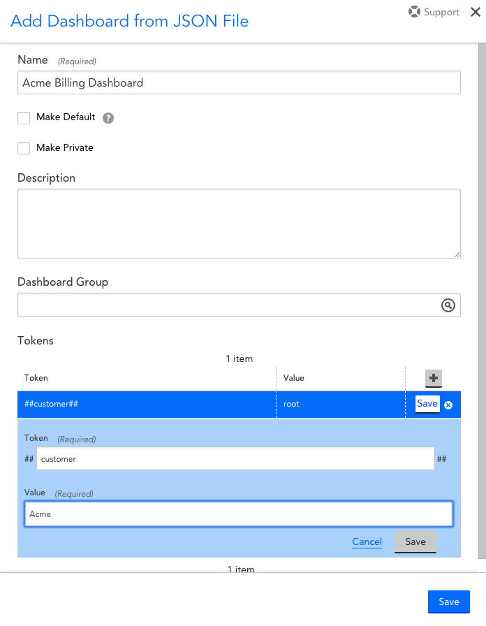
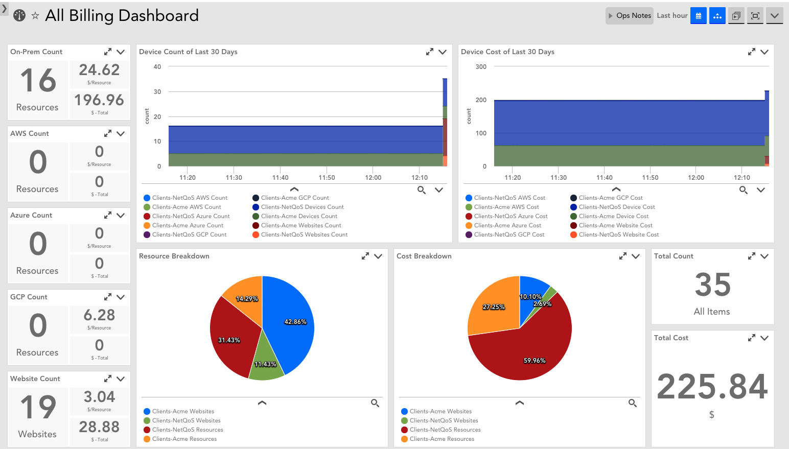

# LogicMonitor Billing Dashboards

For MSPs who wanted to generate some statistics around how many objects are in particular groups. You could easily bill your customers for services delivered. The first iteration worked just fine, but ended up being difficult to implement because the groups were not only named different, but the group structure itself was nothing similar.

## The Datasource Itself
You'll need the datsource file imported into your portal for any of this to work for you. I'm not publishing the datasource configuration file, nor the dashboard configuration file yet, for several reasons. Once I do, I'll update it here.

The second iteration was an opportunity to innovate so I stuck to the "S" principle in SOLID: Single responsibility. I decided that my datasource shouldn't try to do very specific things regarding groups. The end result is that I started by creating a datasource that pulls a list of all groups and gets the counts for every group. This would put all the data in the hands of the user and let them filter out the things that aren't needed.

### Filtering to only report on certain groups
In order to make filtering easier, I added two instance level properties to the datasource definition: depth and fullPath.  Before I go into that, let's see what an example folder structure might look like. This example will be referenced throughout this post.

### Example Folder Structure
```
/ (root)
├── Clients
│   ├── Acme
│   │   ├── Collectors
│   │   ├── Network
│   │   ├── Security
│   │   ├── Server
│   │   └── Virtual Machines
│   └── NetQoS
│       ├── Collectors
│       ├── Network
│       ├── Server
│       └── Virtual Machines
├── Devices By Type
├── Minimal Monitoring
└── My Devices
    ├── Office A
    └── Office B
```

### fullPath
fullPath contains the actual path of the folder. This can be used in a filter to only include folders under certain other folders. For example, since I know my customers' devices are sorted into the Acme and NetQoS folders, I could add a filter like this:
`auto.fullPath CONTAIN "Clients/"`

This would limit discovery to only those folders containing the string "Clients/", which are the following:
```
Clients/Acme
Clients/Acme/Collectors
Clients/Acme/Network
Clients/Acme/Security
Clients/Acme/Server
Clients/Acme/Virtual Machines
Clients/NetQoS/
Clients/NetQoS/Collectors
Clients/NetQoS/Network
Clients/NetQoS/Server
Clients/NetQoS/Virtual Machines
```

This gets us halfway to where we want to be. It included the main client folders (Acme and NetQoS), but also included the groups under them (children of Acme/NetQoS, grandchildren of Clients, and descendants of the root).

### Depth
Depth refers to the distance from the root of each folder. Setting a filter like this:

auto.depth == 2

would get the following folders:

Clients/Acme
Clients/NetQoS
My Devices/Office A
My Devices/Office B

Combining the two folders would get only the main client folders (Acme & NetQoS).  At any rate, any combination of these two filters should allow the user to filter down to just the folders for which we want counts.  If no filters were applied, it would give data on each and every group.

## The Data
The data comes from the LM API. Normally, data in LM is collected from a target and stored under the resource in LM that corresponds to that target. This can be most directly/simply done by adding your LM portal to LM as a device. In my case, since my portal is lmstuartweenig, I added "lmstuartweenig.logicmonitor.com" as a device, using the expert mode. I then disabled everything that was discovered by default (because I don't really need to monitor that, to each his own).

Alternatively, you could avoid adding another resource into your portal by having the datasource collect the data from the API, but storing/associating the data with one of the collectors. This saves you 1 license.  Either way, you need to have a resource in your resource tree to which which the data can be associated. In my case, I added my portal as a resource. The only difference is whether or not you burn a license.

Once you've identified which resource with which the data will be associated, you need to add a few properties. These properties serve two purposes: 1) it signals LM to enable the datasource and where to associate the data and 2) it provides some key information that the datasource will need to access the API. Add the following properties to the device:
|Property Name|Description|
|---|---|
|billing_api.account|This is the account name for your portal. In my case, since my portal address is lmstuartweenig.logicmonitor.com, I'll store "lmstuartweenig" in this property.|
|billing_api.id|[Generate an API](https://www.logicmonitor.com/support/settings/users-and-roles/api-tokens/) token and store the ID here.|
|billing_api.pass|Store the API Key here.|

Once this is done, you can wait 15 minutes and the datasource should have discovered the groups and started collecting data. At this point, you may want to go to the datasource definition and tweak the filters for your purposes.

### Datapoints
The following datapoints are gathered for each folder:
|Datapoint|Description|
|---|---|
|host_count|The total count of all hosts in the group (including hosts in sub-groups)|
|gcp_count|How many GCP devices (not sure if it includes sub-groups, I think it does)|
|azure_count|How many Azure devices (not sure if it includes sub-groups, I think it does)|
|aws_count|How many AWS devices (not sure if it includes sub-groups, I think it does)|
|Total_Count|Simply the sum of host_count, gcp_count, azure_count, aws_count|

### Adding Billing Information
Since one of the original purposes of this data source was to bill customers, it made sense to build in some billing capability. This component is optional and will show "No Data" until it is configured (which I'll detail below).
Since the resulting set of folders normally would represent customers, and since some customers sometimes have different prices for services (gold customers may pay more, for example), and since different type of things could have different costs, you can add a few properties to have the data source calculate some costs as part of the data source with high flexibility.
These properties can be added at the device level. Doing so, would apply the same unit cost to every customer unless a unit cost was applied at the instance level. Let me be clear: the device and instances I'm talking about here are the ones to which the data is associated. Putting these properties on the groups you want to track will have no effect. In my case I added these properties to the lmstuartweenig.logicmonitor.com resource, then added some overrides on the instances under the "Resource Group Member Counts" and "Website Group Member Counts" datasources.

Specifically, you can add the following properties:
|Property|Description|
|---|---|
|billing_api.aws_cost|Unit cost of AWS instances|
|billing_api.azure_cost|Unit cost of Azure instances|
|billing_api.gcp_cost|Unit cost of GCP instances|
|billing_api.resource_cost|Unit cost of devices/resources|
|billing_api.website_cost|Unit cost of a website check|

Once any number of these properties are added, the value of these properties will feed into new datapoints, populated using the formulas shown below:
|Datapoint|Formula|
|---|---|
|aws_total_cost|aws_count X billing_api.aws_cost|
|azure_total_cost|azure_count X billing_api.azure_cost|
|gcp_total_cost|gcp_count X billing_api.gcp_cost|
|host_total_cost|host_count X billing_api.resource_cost|
|website_cost|numOfWebsites X billing_api.website_cost|

Using these newly populated datapoints, you can create a dashboard to display all these metrics along with their corresponding cost. Additionally or alternatively, you could create reports containing all the billing data. I recommend dashboards sent out as reports because they are prettier and easier to digest than a flat table of data. Dashboards also allow you to simplify the verbiage.

One other little caveat: this datasource by default only pulls 50 groups. If you have more than 50 groups in your resource and/or website structure, you'll need to add a property called billing_api.query_limit with a value greater than the total number of folders in the larger structure, recursively.

## Creating the Dashboard
There's a lot that goes into creating a dashboard. Luckily, I've done all the work for you so you can just import the dashboard. However, when importing, you need to understand how the data is filtered down to one customer. The dashboard makes use of tokens, which are just variables that you create on the dashboard level. Particularly, you need to create the ##customer## token where the value is the name of the customer. It's important that the value of this token match the name of the folder containing this customer's resources and websites. Meaning that in order for website data to show up along with resource data, the folders should be named the same (technically they don't have to be the same because the filter looks for any discovered folders containing the value of ##customer##).

In my case, my website folder structure is a bit simpler than my resource group structure:
```
Websites/
├── Acme
├── My\ Stuff
└── NetQoS
```
However, since I have a folder for Acme and a folder for NetQoS and the ##customer## token can cover both my resources and my websites.  After selecting the dashboard definition file to import, All I do is change the dashboard name and update the token. As long as the data is there, it should show everything. Every widget (and you can see the configuration of each one) makes reference to the token so they all filter to only show data concerning the customer of interest.


## Additional (Accidental) Uses
One interesting discovery is that if you're only presenting the data through the dashboard, you can do all the filtering on the dashboard level. Meaning: you could actually discover and track every group's metrics, but by properly using the dashboard token, you can filter out only to the one group you're interested in showing.

Another discovery: If you choose your token wisely, you can get multiple customer's data together on one dashboard to get a breakdown of the counts per customer.  The token would have to be one that would match on all the customer groups that I want to show. Luckily in my case, I have my customer groups under "Clients". The token would then be "Clients-" (the "/" in the path is replaced with a "-" when the instance is named).

Notice in the legends of the pie charts, that it shows one slice for NetQoS' resources and a different slice for Acme's resources.  FYI: ignore the oddness in the top trend plots as a configuration change right before this snapshot caused some historical data to be lost and start gathering again).
