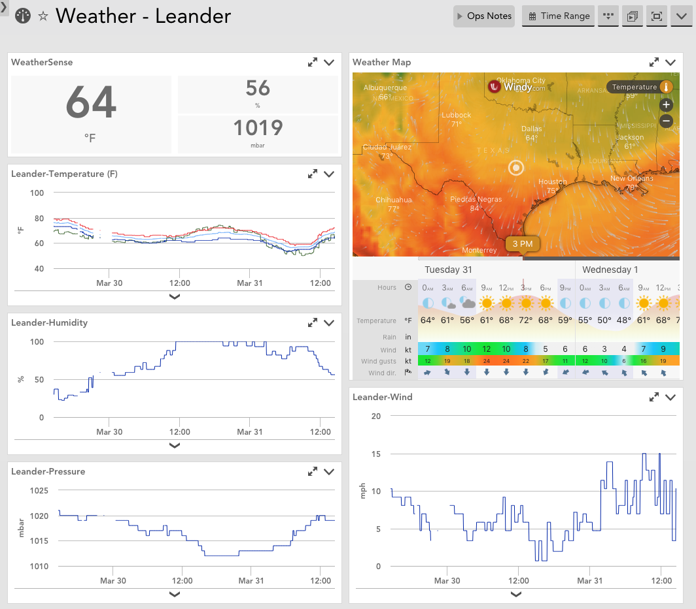

# Weather data from OpenWeatherMap.org
This datasource pulls in weather data given one or more locations. The locations are specified in a property (added to whichever resource(s) you want) called `weather.locations`. The locations list takes on the following format:
```
City1 Name!city1zip|City2Name!city2zip|City3, Name!city3zip
```
The city name can be any name you want displayed (so long as it doesn't have an exclamation point in the name). The zip code determines the location that the data that is fetched describes.

So far, it only appears to work for US zip codes, although it's supposed to work for Canada as well. In my attempts, I couldn't get it to work and found some evidence that it may be a problem with the API.

## Dashboard
This [example dashboard](ExampleDashboard.json) shows one way the data could be brought together in a meaningful dashboard. The dashboard requires you to set three tokens:
1. ##city## - which should match the city name specified in the property above. This determines which city's data is included.
2. ##latitude## & ##longitude## - the coordinates of the city so that the Windy.com weather map will focus on the right location.


