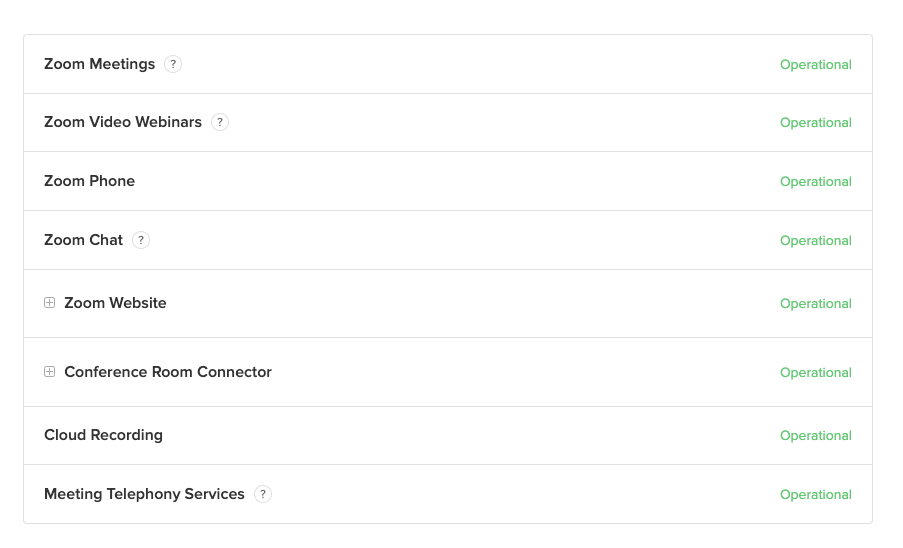
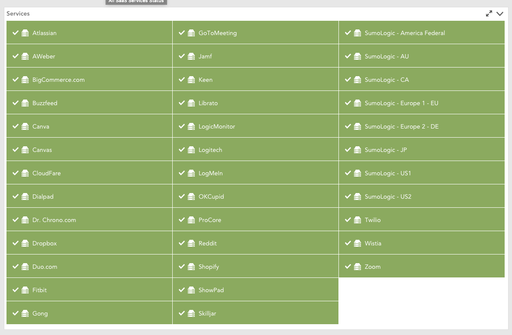
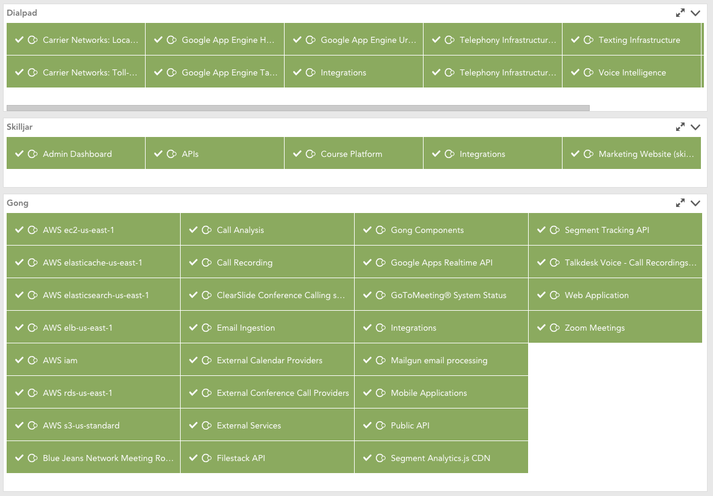

# Status Page Monitoring (if it's hosted by StatusPage.io)

From [my post](https://www.logicmonitor.com/blog/remote-monitoring-third-party-status-pages) on LogicMonitor's blog:

>Are we having fun yet? The debate about whether to allow employees to work from home is now moot. The virus that causes COVID-19 has made working from home a national imperative for those functions that can be done remotely. The implications of this are pretty broad in scope and have IT shops scrambling to address the concerns of management of how to monitor the very apps that enable efficient work from home strategies.
I started this week, at the request of a large, prestigious university, writing LogicModules that include status updates for Zoom. In the process, I discovered that Zoom, like many SaaS Apps, uses a third party to publish their status page, StatusPage.io. This is perfect since some of the power behind LogicMonitor is its extensibility. So I thought it would be useful to expand this coverage to other SaaS applications that use StatusPage.io to publish the status of their services to their customers.
As a team, we scoured the interwebs for SaaS apps that use this same service for their status page. It turns out there are quite a few. In only an hour, we identified 36 different ones including: Atlassian, Buzzfeed, Canvas, CloudFare, Dialpad, Dropbox, Fitbit, Gong, GoToMeeting, LogMeIn, PagerDuty, Reddit, SumoLogic, Twilio, and so many more.
How does it work? StatusPage.io offers a hosted page that shows the status of an application’s components. For Zoom, that page is status.zoom.us, and it looks like this:

StatusPage.io offers an API for those companies that wish to publish their pages in that manner. So fetching the data simply requires a little bit of scripting and a key. The key (more like an ID really), a specific string that identifies the StatusPage.io customer’s services, is relatively easy to obtain manually.

## To add monitoring (Short manual instructions)
1. Import [the DataSource definition](StatusIOServiceStatus/StatusIOServiceStatus.xml) into your portal
2. From the status page:
  * append "/api/v2/status.json" to the status page URL
  * Grab the id from the resulting json (For {"page":{"id":"14qjgk812kgk","name"... the id is 14qjgk812kgk)
3. Add the status page as a resource into your portal:
  * Add the FQDN of the status page as the IP/DNS
  * Make the name something friendly
  * Add a property called "statusio_key" with the id/key fetched earlier as the value

That should get the device in and discovery started. Wait a few minutes and you should see the component services discovered and data should start flowing in.

## Still, it can be easier
Once you have both the [DataSource](StatusIOServiceStatus/StatusIOServiceStatus.xml) and the [PropertySource](StatusIOKey/StatusIOKey.json) added to your portal, add the status page to your LogicMonitor portal as a resource. Start by going to the Resources page and clicking Add >> One Device >> Expert. For the IP Address/DNS name, put the status page address. For example, if you wanted to monitor GoToMeeting, you’d use “status.gotomeeting.com.”  For the name, put a nice friendly name for the App (like “GoToMeeting”). LogicMonitor needs at least the HTTPS DataSource to apply and collect data in order to consider the device “not dead”. If the device is considered “dead”, you won’t get any alarms. You can disable any other DataSources you might not find necessary for this device.

The PropertySource should go find the key for you and load it in as a property, which will trigger the DataSource to discover the services. Once they are discovered, LogicMonitor will start monitoring the services and open alarms whenever the status is not “operational.”

It is possible that the PropertySource won’t automatically find the key for the status page you’re trying to monitor. If this is the case, you’ll need to grab the key manually and add it as statusio_key. To find the key manually, go to the status page then append “/api/v2” to the URL. You should see the API page. On that page, there is an example found in the Summary section. You can see the key without expanding, but if you want to copy/paste, you’ll need to expand. Look for the key in the endpoint URL as shown below:

Now you have the data and try not to get alarmed, but what about a dashboard? You can use the NOC widget to display the data either aggregated by service:

Or you could also use the NOC widget to display the data of each component of a single service:

## Sample Dashboard
If you need some help getting started building a dashboard, you can import [this tokenized dashboard](Sample Tokenized Dashboard.json) into your portal. You'll need to change the ##defaultResource## token by editing the dashboard. Set the value to the friendly name of the resource you added above.

We've identified the following sites that use StatusPage.io to host their status page. We've looked up the key for you so you don't have to. This isn't an exhaustive list. If you think a status page is hosted by StatusPage.io, simpliy append "/api/v2/status.json" to the status page. If that loads, you should be able to find the id. If you do find a new id, please send it our way so we can add it to our list here. If you manually enter the id, the PropertySource "StatusIOKey" isn't needed.
### Discovered Keys
|Name|URL|Key|
|---|---|---|
|Atlassian|https://metastatuspage.com|2j98763l56x|
|AWeber|https://status.aweber.com|bjqyd6ttxjk7|
|BigCommerce|https://status.bigcommerce.com|qbn4dyd29jby|
|BuzzFeed|https://status.buzzfeed.com|1cdp54tg9bv9|
|Canva|https://www.canvastatus.com|3hg3yf1shl9k|
|Canvas|https://status.instructure.com|nlxv32btr6v7|
|CloudFlare|https://www.cloudflarestatus.com|yh6f0r4529hb|
|DataDog|https://status.datadoghq.com|1k6wzpspjf99|
|DataDog Integrations|https://datadogintegrations.statuspage.io/|tbc0zy2gb6bf|
|DataDog EU|https://status.datadoghq.eu/|5by3sysm209d|
|Datto|https://status.datto.com|9wpk4y80vt4s|
|DialPad|https://status.dialpad.com|80trk830s0hg|
|DrChrono|https://status.drchrono.com|ftd21120x69r|
|Dropbox|https://status.dropbox.com|t34htyd6jblf|
|Duo Security|https://status.duo.com|qrxf5mzbrsxw|
|Fitbit|https://www.fitbitstatus.com|rcw3d4yzqkqg|
|GitHub|https://www.githubstatus.com|kctbh9vrtdwd|
|GongIO|https://status.gong.io|wr00cbpjhn6r|
|GoToMeeting|https://status.gotomeeting.com|kwzln7bn4hg8|
|Hubspot|https://status.hubspot.com|8b9w1wwq3g7d|
|Jamf|https://status.jamf.com|5z7bmx2nb2yj|
|JumpCloud|https://status.jumpcloud.com|nflr6k3n1c0h|
|Keen IO|https://status.keen.io|z3mvdbpvy7yh|
|Liberato|https://status.librato.com|636574ls1dpd|
|Logicmonitor|https://status.logicmonitor.com|vgvrd21p58vb|
|Logitech|https://status.logitech.com|zbr74ch8kcdy|
|MindBody|https://status.mindbodyonline.com|xfhhcblmbpbd|
|Monday.com|https://status.monday.com|zh081jts88wj|
|MuleSoft|https://status.mulesoft.com|rl5vblzz3gbw|
|OkCupid|https://status.okcupid.com|pqtr9kytt07d|
|PagerDuty|https://status.pagerduty.com|33yy6hwxnwr3|
|Pendo.io|https://status.pendo.io|qxvy69hcwh22|
|Peloton|https://status.onepeloton.com|mp8rwtf7yt9p|
|Postman|https://status.postman.com|ms1frkqnsp7r|
|ProCore|https://status.procore.com|jxb4w0vdl2tv|
|Reddit|https://www.redditstatus.com|2kbc0d48tv3j|
|Shopify|https://status.shopify.com|d33g96wd23dd|
|Showpad|https://status.showpad.com|z87gt5b68cql|
|Skilljar|https://status.skilljar.com|by5hq8p4g556|
|Smartsheet|https://status.smartsheet.com|tvv76p250rdk|
|Sumo Logic|https://status.sumologic.com|8 keys|
|Tableau|https://trust.tableau.com|g7fqbfflg42q|
|Trello|https://trello.status.atlassian.com|h5frqhb041yq|
|Twilio|https://status.twilio.com|gpkpyklzq55q|
|Wistia|https://status.wistia.com|750cwd148kqj|
|Zoom|https://status.zoom.us/|14qjgk812kgk|
